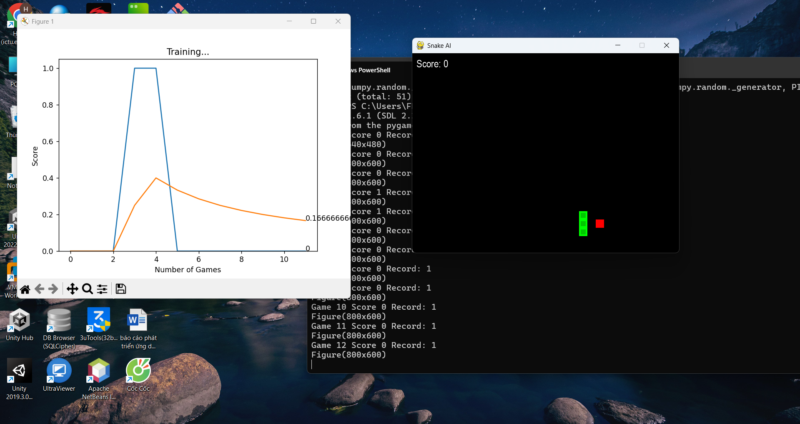

# 🐍 Trò Chơi Rắn AI

Một trò chơi Rắn cổ điển được điều khiển bởi tác nhân AI sử dụng **Deep Reinforcement Learning**.  
Dự án được viết bằng **Python** với giao diện sử dụng **Pygame**, đồng thời dùng **PyTorch** để huấn luyện AI chơi.

---

## 📂 Cấu Trúc Dự Án

| File           | Mô tả                                                   |
| -------------- | ------------------------------------------------------- |
| `snake_game.py`| Môi trường trò chơi Rắn với Pygame                      |
| `agent.py`     | Tác nhân AI sử dụng deep Q-learning                      |
| `train.py`     | Vòng lặp huấn luyện AI tương tác và học chơi            |

---

## ⚙️ Yêu Cầu Hệ Thống

- Python 3.x  
- [Pygame](https://www.pygame.org/news)  
- [NumPy](https://numpy.org/)  
- [PyTorch](https://pytorch.org/)

---

## 🚀 Cài Đặt Nhanh

1. **Clone** hoặc tải dự án về:

```bash
git clone https://github.com/yourusername/snake-ai.git
cd snake-ai
```

2. Tạo và kích hoạt môi trường ảo (khuyến nghị):

```bash
python -m venv venv
# Trên Windows
venv\Scripts\activate
# Trên macOS/Linux
source venv/bin/activate
```

3. Cài đặt thư viện cần thiết:

```bash
pip install -r requirements.txt
```

---

## ▶️ Cách Chạy và Huấn Luyện AI

Chạy vòng lặp huấn luyện AI:

```bash
python train.py
```

AI sẽ bắt đầu chơi và tự học để tăng điểm số qua từng lần chơi.

---

## 🛠️ Chi Tiết File `snake_game.py`

- Quản lý logic và giao diện trò chơi với Pygame  
- Di chuyển rắn, tạo thức ăn, kiểm tra va chạm  
- Hiển thị điểm số  
- Điều chỉnh tốc độ qua biến `SPEED`

---


## 💡 Lưu Ý

- Để đóng game an toàn, bạn có thể đóng cửa sổ hoặc nhấn ESC (nếu được thêm trong logic).  
- Quá trình huấn luyện có thể mất thời gian tùy cấu hình máy.  
- Bạn có thể sử dụng `matplotlib` kết hợp `IPython.display` để xem đồ thị tiến trình huấn luyện (trong Jupyter Notebook).

---

## 📝 Giấy Phép

Dự án được cung cấp "như hiện có" chỉ với mục đích học tập và nghiên cứu.
=======

# 🐍 Trò Chơi Rắn AI

Một trò chơi Rắn cổ điển được điều khiển bởi tác nhân AI sử dụng **Deep Reinforcement Learning**.  
Dự án được viết bằng **Python** với giao diện sử dụng **Pygame**, đồng thời dùng **PyTorch** để huấn luyện AI chơi.

---

## 📂 Cấu Trúc Dự Án

| File           | Mô tả                                                   |
| -------------- | ------------------------------------------------------- |
| `snake_game.py`| Môi trường trò chơi Rắn với Pygame                      |
| `agent.py`     | Tác nhân AI sử dụng deep Q-learning                      |
| `train.py`     | Vòng lặp huấn luyện AI tương tác và học chơi            |

---

## ⚙️ Yêu Cầu Hệ Thống

- Python 3.x  
- [Pygame](https://www.pygame.org/news)  
- [NumPy](https://numpy.org/)  
- [PyTorch](https://pytorch.org/)

---

## 🚀 Cài Đặt Nhanh

1. **Clone** hoặc tải dự án về:

```bash
git clone https://github.com/yourusername/snake-ai.git
cd snake-ai
```

2. Tạo và kích hoạt môi trường ảo (khuyến nghị):

```bash
python -m venv venv
# Trên Windows
venv\Scripts\activate
# Trên macOS/Linux
source venv/bin/activate
```

3. Cài đặt thư viện cần thiết:

```bash
pip install -r requirements.txt
```

---

## ▶️ Cách Chạy và Huấn Luyện AI

Chạy vòng lặp huấn luyện AI:

```bash
python train.py
```

AI sẽ bắt đầu chơi và tự học để tăng điểm số qua từng lần chơi.

---

## 🛠️ Chi Tiết File `snake_game.py`

- Quản lý logic và giao diện trò chơi với Pygame  
- Di chuyển rắn, tạo thức ăn, kiểm tra va chạm  
- Hiển thị điểm số  
- Điều chỉnh tốc độ qua biến `SPEED`

---


## 💡 Lưu Ý

- Để đóng game an toàn, bạn có thể đóng cửa sổ hoặc nhấn ESC (nếu được thêm trong logic).  
- Quá trình huấn luyện có thể mất thời gian tùy cấu hình máy.  
- Bạn có thể sử dụng `matplotlib` kết hợp `IPython.display` để xem đồ thị tiến trình huấn luyện (trong Jupyter Notebook).

---

### kết quả dự ánán


